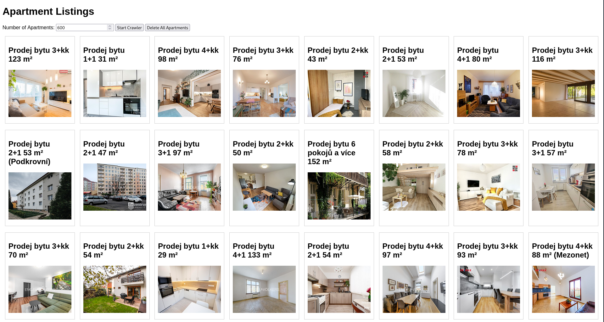

# Luxonis-challenge

Luxonis challenge for building a simple webpage scraper with its own webpage for https://www.sreality.cz/. 




## Running the code

The code can be run with a simple start up command:

```bash
docker compose build && docker compose up
```

and for shutting the application down you can either kill it (CTRL + C) or shut down all 3 containers from a sepparate CLI:

```bash
docker stop scraper-nginx:v1 && docker stop scraper-api:v1 && docker stop postgres:15.6
```


## Project structure

The project is comprised of 3 sepparate Docker containers as follows:

- **Simple backend scraping API**
- **Nginx proxy**
- **Postgres database**

General project settings are available in the environment file, changing some settings may require additional setup of the NGINX config since those can not be generated dynamicaly.


### Simple backend scraping API

The API has three available methods on its custom endpoint served through NGINX reverse proxy:

- **POST request:** http://127.0.0.1:8080/scraper-api/v1/start-scraper - (Accepts a single JSON argument named "item_count" which sets the number of apartment ads the scraper will fetch from the webpage)
- **GET request:** http://127.0.0.1:8080/scraper-api/v1/flat-items - (Fetches all currently available entries of apartments in the database)
- **DELETE request:** http://127.0.0.1:8080/scraper-api/v1/clear-flats - (Deletes all curently available entries of apartments in the database)

The API in rough runs the scrapy based scraper in the background via running a subprocess command in Python. This can be improved using a custom asyncio sub-loop or concurent loop in which we would run the scraper therefore not blocking the original API code.

Dependency management is done using Poetry as a more standard way instead of python requirements files or various proprietary python environment solvers like conda.


### Nginx proxy

The NGINX proxy handles serving of the static webpage which makes requests to the API endpoint depending on the buttons pressed on the webpage. It also features a standard JSON error code list in case we would want to expand the API and add more features. 

### Postgres database

The database currently has one table names: **flat_ads** with two fields: **title** (Name of the flat advertisement) and **image** (Path to the image of the flat advertisement).